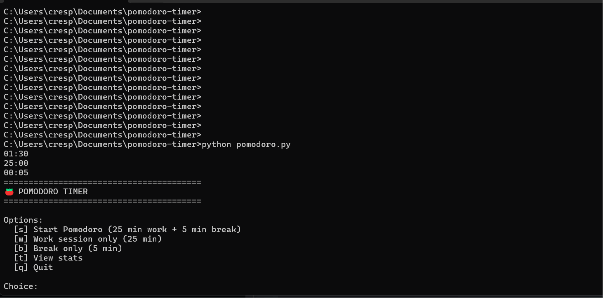

# Pomodoro Timer CLI

A simple command-line Pomodoro timer with session tracking. This is one of the small public utility projects listed in `Portfolio/src/data/projects.ts`.

## Role In The Business

- This repo is a lightweight showcase tool.
- It helps demonstrate that CSolutions can build small useful utilities in addition to websites and dashboards.
- It is low priority in the weekly workflow, but it still belongs to the public portfolio lane.

## Shared Docs

- `AGENTS.md`
- `CLAUDE.md`
- `AI-WORKFLOW.md`
- `SECURITY-CHECKLIST.md`

## Features

- 25-minute work sessions and 5-minute breaks
- Live countdown with progress bar
- JSON-backed session tracking
- Stats for sessions completed today and this week

## Stack

- Python
- JSON session storage
- no external runtime dependencies

## Local Development

```bash
python3 pomodoro.py
```

The app has no package install step.

## Usage

```text
Options:
  [s] Start Pomodoro (25 min work + 5 min break)
  [w] Work session only (25 min)
  [b] Break only (5 min)
  [t] View stats
  [q] Quit
```

## Demo



## Project Notes

- session history is stored in `data/sessions.json`
- the main entry point is `pomodoro.py`
- use this repo as a small, tidy CLI showcase, not a large product lane
- copied `.agents/skills/` and `.claude/skills/` folders are local-only and ignored

## Security Notes

Run `SECURITY-CHECKLIST.md` before publishing changes. For this repo, the main concerns are accidental data-file commits, local-path assumptions, and keeping the repo free of stray secrets.
